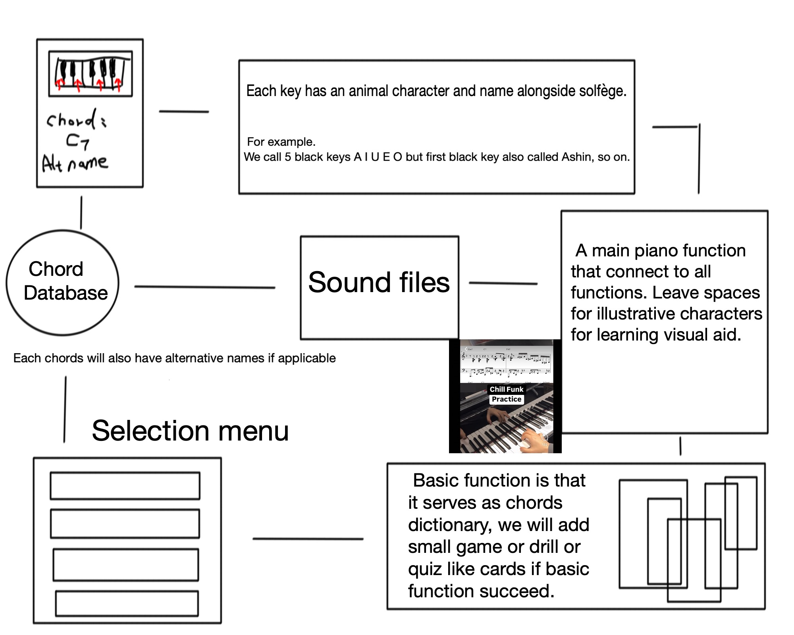

# 🎵 Whimsical Solfège Studio 🌸  
## 🪄 Project Board
👉 [View Live Project Board]([https://github.com/users/YourUsername/projects/1](https://github.com/users/WillSnakeTaka/projects/4))

*Animated Solfège for gentle, self-paced learning*  

  

  
  
  

---

## 🌱 About  
Whimsical Solfège Studio is a tiny, experimental tutor built with **Flutter**.  
Instead of dry theory, every note is a character with color, mood, and story.  

Our solfège is extended beyond the usual seven notes:  

- **White keys (natural tones):**  
  **Do (d), Ze (z), Mi (m), Fa (f), So (s), La (l), Ci (c), Do (d)**  
- **Black keys (chromatic tones):**  
  **A, I, U, E, O**  

Each one gets its own **color, emoji, and personality**.  
Think of it as a *children’s animation meets music pedagogy*.  

---

## ✨ Goals (MVP)  
- 🎹 **On-screen keyboard** with 12 semitones  
- 🧚 **Tone characters** with colors + emojis  
- 📖 **Guided stories** where characters teach intervals  
- 📊 **Simple drills**: play & match, quizzes  
- 💾 **Progress tracking** (start with JSON, move to SQLite later)  

---

## 📚 Example Characters  
| Symbol | Name | Emoji  | Personality |
|--------|------|-------|-------------|
| d      | Do   | 🟢    | Calm, grounding |
| z      | Ze   | 🌀    | Curious, playful |
| m      | Mi   | 🌞    | Bright, optimistic |
| f      | Fa   | 🌸    | Gentle, nurturing |
| s      | So   | ⭐    | Steady, guiding |
| l      | La   | 🌙    | Dreamy, thoughtful |
| c      | Ci   | ❄️    | Cool, mysterious |
| a      | A    | 🔮    | Magical accent |
| i      | I    | 💠    | Introspective |
| u      | U    | 🌊    | Flowing, deep |
| e      | E    | 🍃    | Fresh, sprouting |
| o      | O    | 🔥    | Fiery, bold |

*(Not fanalized)*  

---

## 🚀 Tech Stack  
- **Flutter 3.22+ / Dart**  
- **UI/Animation:** Rive (tone characters)  
- **Audio:** `just_audio` (simple samples)  
- **Storage:** JSON → SQLite (later)  
- **Version Control:** GitHub repo  
- **Project Board:** GitHub Projects (Kanban)  

---

## 🎹 Planned User Flow  
1. **Launch app**  
2. Pick a mode → Quick Drill / Guided Story / Keyboard  
3. Meet a tone → animation plays, sound plays  
4. Prompt → tap the right key or answer quiz  
5. Score saved locally, suggested next drill  

---

## ⏳ Semester Schedule (Draft)  
- **Sept 1–15:** Tone identities, palette, basic Flutter scaffold  
- **Sept 16–30:** Keyboard demo (visual only)  
- **Oct 1–15:** Audio playback + 1–2 drills  
- **Oct 16–31:** Guided story prototype (Do + So)  
- **Nov 1–15:** Add 5 more tones + simple progress tracking  
- **Nov 16–30:** Chord dictionary draft, polish UI  
- **Dec 1–5:** Final testing, presentation demo build  

---

## 💖 Contributing  
This is a **class project in progress**.  
- Keep PRs tiny and clear.  
- Default Flutter lints are fine.  
- Content first (JSON lessons), DB later.  

---

## 📜 License  
MIT License — see [LICENSE](LICENSE).  

---

